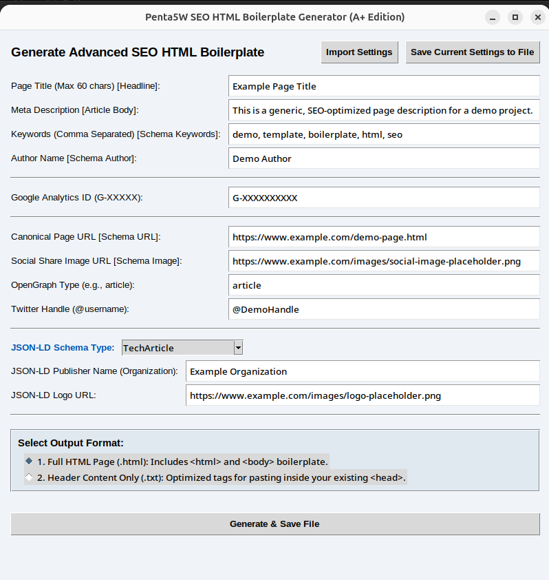

The Complete SEO Toolkit

📈 Take Control of Your SEO and Get an A+ Rating

Welcome to the seo-toolkit! This open-source project provides two essential Python tools to help you take full control of your website's Search Engine Optimization (SEO) without spending thousands of dollars on expensive online services.

By combining the structural integrity provided by the HTML Generator and the critical feedback from the SEO Checker, and pairing this with the free, powerful data from Google Analytics and Google Search Console, you have a complete, self-managed toolkit to ensure your website is perfectly optimized. You will be able to achieve an A= rating on foundational SEO quality by following the best practices enforced by these tools.

🌟 Key Features

The toolkit is comprised of three distinct, powerful Python applications:

1. seo-html-generator.py (The Builder)

This is a Graphical User Interface (GUI) application (using Tkinter) designed to create a perfectly structured, ready-to-use HTML boilerplate with essential SEO metadata.

GUI-Driven: Easy-to-use desktop application for quick generation.

Metadata Control: Allows you to define critical fields like Title, Meta Description, Keywords, and Author.

Save/Load Settings: Ability to save and load your common settings (e.g., site author, general keywords) to a JSON file for rapid deployment across multiple pages.

2. seo-checker.py (The Auditor)

This is a Command-Line Interface (CLI) application that runs a deep technical audit on any given HTML page or live URL. It ensures your page meets the highest quality standards set by search engines.

Dual Source Audit: Check the SEO quality of a local HTML file or a live website URL.

Quality Metrics: Checks against best-practice configurations, including Title character limits (max 60) and Meta Description limits (70-160 characters).

Structured Data Verification: Validates the presence of Schema Markup for types like Article, Product, FAQPage, and more, checking for required properties.

Comprehensive Tag Audit: Scans for a wide range of essential tags, including those related to PWA, Icons, and performance-boosting relations like preload and dns-prefetch.

Remediation Report: Generates a detailed report outlining all issues and suggestions for fixing them.

3. sitemap-generator.py (The Sitemap XML Generator)

The Local File Sitemap XML Generator is a Python desktop application built using Tkinter. Its purpose is to scan a local directory of website files (HTML, CSS, JS, etc.) and automatically generate a standards-compliant sitemap.xml file.

Unlike traditional web crawlers, this tool does not connect to the internet or crawl a live website. It simply reads your local file system, determines the relative paths, and combines them with a user-provided base URL to construct the final sitemap links.

💻 Installation

The toolkit requires Python 3 to run.

Prerequisites

You need to install the required Python libraries using pip:

pip install requests beautifulsoup4

Note: The tkinter library for the GUI is typically included with standard Python installations on most operating systems.

🚀 Usage

Step 1: Generate Your SEO-Optimized HTML Boilerplate

Use the generator to create a new page foundation or quickly update the metadata for an existing one.

Run the GUI application:

python seo-html-generator.py

A window titled "Penta5W.com SEO HTML Boilerplate Generator (A+ Edition)" will open.

Fill in the required fields (Title, Description, etc.).

Click the Generate HTML button, choose a save location, and the tool will write the highly-optimized .html file.

Step 2: Audit and Validate Your Code

Use the checker to confirm that your newly generated (or existing) HTML file meets the "A=" quality standard.

Run the command-line application:

python seo-checker.py

You will be prompted with a menu:

Choose your audit source:
1. Local File (HTML file on your computer)
2. Web URL (Live website address)
3. Exit

For local files (e.g., the one you just generated): Enter 1, then provide the full file path (e.g., /path/to/my-page.html).

For a live website: Enter 2, then provide the full URL (e.g., https://www.example.com). The script will automatically add the https:// protocol if missing for convenience.

The script will perform a comprehensive audit and save a detailed remediation report to a file in the same directory, guiding you through any required fixes.

🌐 The Complete SEO Toolkit: Go Pro (For Free)

To truly master your SEO and consistently achieve top search rankings, combine the technical foundation provided by this toolkit with the industry-standard analysis tools from Google.

This combination allows you to understand what to fix (from the seo-checker report), how to build it (with the seo-html-generator), and how it is performing in the real world (via Google's platforms).

1. Google Search Console

Purpose: This is your primary tool for monitoring your site's presence in Google Search results.

Submitting Your Content: Ensures Google can find, crawl, and index your pages.

Performance Reports: See which search queries bring users to your site, what your click-through rate (CTR) is, and your average position.

Troubleshooting: Receive alerts for indexing issues, mobile usability problems, and core web vitals errors.

🔗 Access Google Search Console here: https://search.google.com/search-console/about

2. Google Analytics

Purpose: This tool helps you understand user behavior after they click through from the search results to your site.

Behavior Analysis: See how long users stay, which pages they visit, and where they exit.

Conversion Tracking: Measure the impact of your SEO work on your business goals (e.g., purchases, form fills, sign-ups).

Audience Insights: Understand the demographics and technology used by your organic search visitors.

🔗 Access Google Analytics here: https://marketingplatform.google.com/about/analytics/

Local File Sitemap XML Generator

🌐 Overview

The Local File Sitemap XML Generator is a Python desktop application built using Tkinter. Its purpose is to scan a local directory of website files (HTML, CSS, JS, etc.) and automatically generate a standards-compliant sitemap.xml file.

Unlike traditional web crawlers, this tool does not connect to the internet or crawl a live website. It simply reads your local file system, determines the relative paths, and combines them with a user-provided base URL to construct the final sitemap links.

✨ Features

Local Scanning: Scans all files recursively within a selected root directory.

Intelligent URL Construction: Automatically handles file paths, converting them to URL formats (using forward slashes /).

Root Index Handling: Correctly maps root index files (e.g., index.html in the root folder) to the base URL (/).

Custom Base URL: Allows you to define the necessary public domain prefix (e.g., https://www.example.com) for the final URLs.

Sitemap Customization: Allows setting default values for priority and changefreq.

Timestamp-Based lastmod: Uses the actual file modification time (os.path.getmtime) for the lastmod tag, ensuring the sitemap reflects the most recent changes.

Directory Exclusion: Skips common non-website directories like .git, node_modules, and venv.

XML Output: Generates a well-formatted, indented sitemap.xml file.

🛠️ Requirements

The application is written in Python and uses standard libraries, including Tkinter for the graphical user interface.

Python: Version 3.x is required.

Built-in Libraries: tkinter, os, datetime, xml.etree.ElementTree. No external installation is needed for these.

How to Run

Execute: Run the script from your terminal:

python sitemap-generator.py

🚀 How to Use the GUI

The application provides a straightforward user interface broken down into three main steps:

1. Select Root Folder

This is the physical directory on your computer that represents the root of your website (e.g., your local public_html, build, or dist folder).

Click the "Browse..." button and select the top-level folder of your project.

2. Enter Base Public URL

This is the most crucial step. This URL is used as the prefix for every link in the sitemap. It tells search engines the absolute path to your files.

Input: Enter your full, publicly accessible domain name, including the scheme (http:// or https://).

Example: If you enter https://mysite.com and the tool finds a local file named about/contact.html, the resulting URL in the sitemap will be https://mysite.com/about/contact.html.

3. Generate Sitemap

Before clicking the button, you can optionally set the Default Priority (e.g., 0.5 for regular pages, 1.0 for the homepage) and the Default Change Frequency (e.g., monthly).

Click "Generate Sitemap from Local Files".

The application will scan the folder and log all indexed URLs in the text box.

Upon completion, a dialog will open prompting you to save the output file (usually named sitemap.xml).

📄 Generated Sitemap Structure

The resulting XML file will adhere to the Sitemaps Protocol and include the following elements for each indexed file:

Tag

Purpose

Source

<loc>

The URL location of the document.

Combination of Base URL and the local file path.

<lastmod>

The last modification date of the file.

Read directly from the file's timestamp on your hard drive.

<changefreq>

How frequently the page is likely to change.

User-defined default (e.g., weekly).

<priority>

The priority of this URL relative to others on your site (0.0 to 1.0). 

🚀 Quick Start Self Hosted Web Analytics Platform

This is a complete, self-hosted web analytics platform that provides real-time insights into user behavior without relying on third-party services. Simply clone the repository into your web server's /analytics/ directory, configure Apache, and start tracking user interactions immediately. The platform includes session tracking, custom event monitoring, and a beautiful real-time dashboard.

🔧 Core Features

Real-time Analytics Dashboard - Beautiful, responsive dashboard with auto-refresh every 15 seconds

Session Tracking - Complete user journey tracking with 30-minute session timeouts

Custom Event Tracking - Monitor button clicks, form submissions, downloads, and custom events

Device & Browser Analytics - Comprehensive device, browser, and operating system insights

Error Monitoring - JavaScript error tracking and performance monitoring

Data Export - Export complete analytics data in JSON format

🛡️ Privacy & Security

Your data never leaves your server. This platform ensures 100% data ownership with built-in security features including .htaccess protection, input validation, and secure file permissions. Perfect for organizations that prioritize data privacy and compliance with regulations like GDPR.

📁 Easy Setup

All files are designed to work from a single /analytics/ directory. The platform uses pure JavaScript (tracker.js), PHP (for data processing), and flat-file storage (analytics.log) - no database required. Includes complete Apache configuration guide and security hardening instructions.

💡 Perfect For

Businesses wanting to own their analytics data

Developers needing custom event tracking

Organizations with privacy/regulatory requirements

Anyone tired of Google Analytics complexity and data sharing

Educational institutions and government agencies

